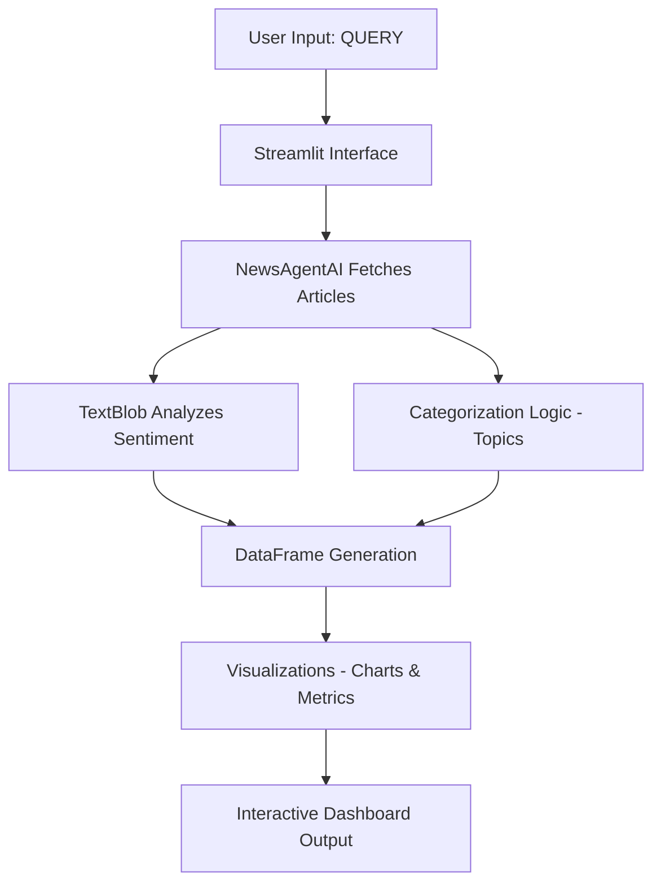
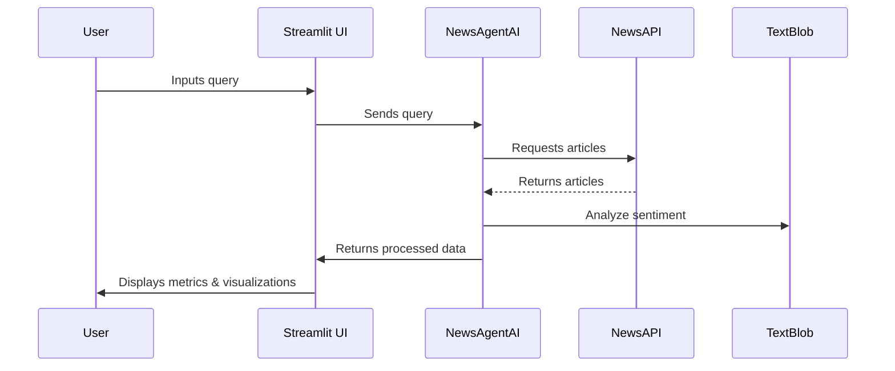
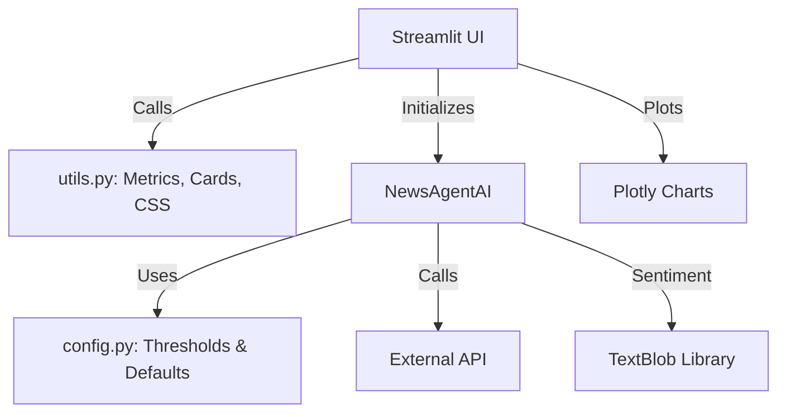
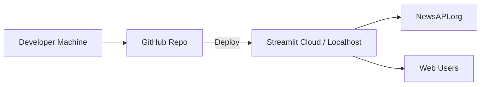
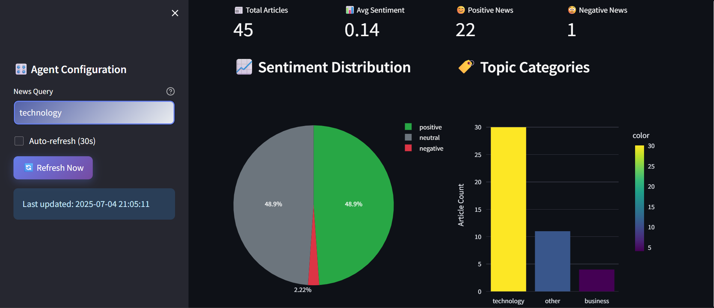

# 📰 News Sentiment AI Agent

An intelligent Streamlit-based application that fetches real-time news articles, performs sentiment analysis, categorizes topics, and provides dynamic insights with visual analytics.

## 🚀 Features

- 🔍 Query news articles in real-time using NewsAPI
- 😊 Sentiment analysis using TextBlob
- 🧠 AI-generated insights and alerts
- 📊 Visualizations: pie charts, bar charts, sentiment timelines
- 📰 Article previews with filtering and expanders
- 🌐 Fully styled and responsive Streamlit UI

---

## 🛠️ Tech Stack

- **Python** 3.10+
- **Streamlit**
- **TextBlob** for sentiment analysis
- **Plotly** for data visualization
- **NewsAPI** for live news fetching
- **dotenv** for environment configuration

---

## 🔄 System Architecture

---

## 📦 Sequence Diagram



---

## 🧩 Component Architecture



---

## ☁️ Deployment Overview



---

## 🔧 Setup Instructions

### 1. Clone the Repository
```bash
git clone https://github.com/your-username/news-sentiment-agent.git
cd news-sentiment-agent
```

### 2. Create and Activate Virtual Environment (optional)
```bash
python -m venv env
source env/bin/activate  # or .\env\Scripts\activate on Windows
```

### 3. Install Dependencies
```bash
pip install -r requirements.txt
```

### 4. Set Up Environment Variables
Create a `.env` file in the root directory:
```ini
NEWS_API_KEY=your_actual_newsapi_key_here
```

### 5. Run the Application
```bash
streamlit run main.py
```

---

## 📁 Project Structure
```
├── main.py                # Streamlit app logic
├── NewsAgentAI.py         # Core class for news fetching & sentiment analysis
├── config.py              # Configurable thresholds & defaults
├── utils.py               # UI utilities for styling and metrics
├── styles.css             # Custom CSS for Streamlit UI
├── .env                   # Your API key (not included in repo)
├── requirements.txt       # Dependencies
└── README.md              # You're reading it!
```

---
### 🚀 Live Demo

Check out the live app here:  
🔗 [**NewsAgentAI Dashboard**](https://aishwaryareddy05-news-sentiment-analysis-agent-main-qvonit.streamlit.app/)

> 📌 *Hosted on Streamlit Cloud*

## ✨ Screenshots



---

## 📌 Notes
- All hardcoded values (API keys, thresholds, defaults) have been externalized.
- Includes fallback sample data if API fails.
- Streamlit auto-refresh supported (30s interval).

---

## 📄 License
MIT License © 2025 
